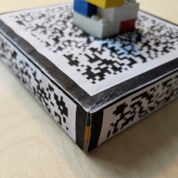
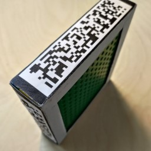
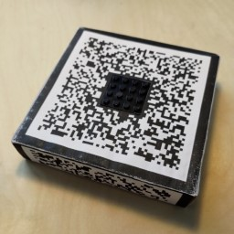
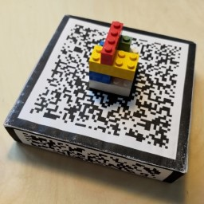

# Tangible Version Control

Prototype implementation of the interaction design proposed in the paper 'Tangible Version Control: Exploring a Physical Object's Alternative Versions'.

TVC (Tangible Version Control) is the attempt at transferring the ideas of version control systems into the real world with the help of augmented reality.
Alternative versions of a physical object are displayed in a timeline and can be explored in the real world by moving the corresponding physical object.
Differences between the physical object and an alternative version are displayed on the object itself.
TVC uses augmented reality and marker tracking.
It is developed for HoloLens.

## Technologies

- Unity 2019.4.23f1
- Vuforia 9.8.8
- Mixed Reality Toolkit 2.7.0

## Setup

Import the Unity project via UnityHub, use a Unity 2019.4 LTS version.
Make sure your Unity installation includes build tools for Universal Windows Platform.
The project contains all required files, including Vuforia and Mixed Reality Toolkit.

## Scenes

The Unity project contains following scenes:

- EditorScene:
You can experiment with interactions between main object and timeline in the `_EditorScene`.
This also the primary place for development.
As no camera functionalities are used, all interactions are emulated in the Unity editor with mouse and keyboard input.

- FlatMarkerScene & CubeMarkerScene:
Scenes that can be used to test functionalities and tracking behaviour in the Unity editor.
These scenes are also the ones that are deployed on the HoloLens.
`FlatMarkerScene` uses a single flat image marker that is tracked by Vuforia.
`CubeMarkerScene` instead uses a cube marker, to allow tracking of the object even from low side angles.

When making changes during development, for example in the `_EditorScene`, make sure to apply those changes to the `FlatMarkerScene` and `CubeMarkerScene` aswell.

## Logic

References between different managers in the scene are managed by the `AppManager.cs`, which is a singleton.
Other scripts are supposed to access the app manager for references to objects in the scene. 
The `StartupManager.cs` sets the scene stage ready and makes sure that all components are initialized.
The `TimelineManager.cs` contains logic about placing and replacing the timeline, as well as altering its appearance or highlighting objects.
The `ComparisonManager.cs` manages functionalities of comparing the physical object to a virtual one.
This includes the initialization of a comparison and switching between comparison modes.

## Deployment

The build target needs to be switched to Universal Windows Platform.
If your target is HoloLens version 1, select `x86` as architecture in the Build Settings window.
If you are building to HoloLens version 2, select `ARM64`.
Make sure u build either the `CubeMarkerScene` or the `FlatMarkerScene`.
The built solution can then be deployed on the device via Visual Studio.

## Preparation

As the use of TVC includes a physical object the interaction evolves around, a physical object is required to display information on, as well as a marker to track the object.
You can either use a flat image marker or build a cube marker.
Files prepared for printing can be found in the Materials folder.
The physical object is mounted in the center of the marker.
The center should be cut so that it fits a 4x4 LEGO baseplate.

The cube marker is 30 mm high.
This roughly corresponds to two full height LEGO blocks, two baseplates, and a flat plate on the bottom.
The cube marker is glued together to enclose the inner content.
A face on the bottom of the cube is not required.
Materials for printing the marker and a list of required parts for building the physical object can be found in the folder 'Materials'.

The cube marker can also be used with the `FlatMarkerScene`.
If you only want to build a flat marker, tape the marker to a LEGO plate to make it stable.

## Known Issues

Outlines are utilized to display differences between versions or to highlight objects in the timeline.
The outline functionalities provided by the Mixed Reality Toolkit are used (`MeshOutline.cs`, `MeshHierarchy.cs`, `MeshSmoother.cs`).
Mesh smoothing is required to make the outlines appear correctly.
When destroying gameobjects that use the MeshSmoother script and were previously created out of an existing gameobject, a shared mesh gets destroyed which leads to NullPointerExceptions.
This does not impair the functionality of the implemented comparison modes.
